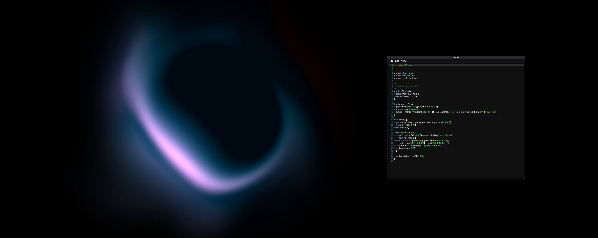
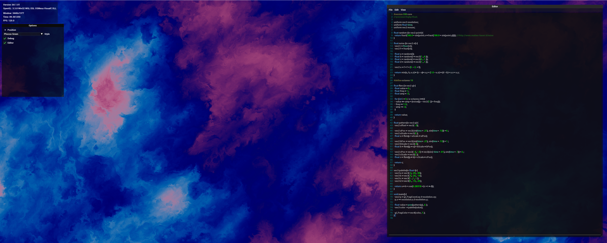

<div align="center">


<h1>Shader Editor and Viewer using ImGui
<h3>This is supposed to become a opengl (glsl) shader editor and viewer<br>
its using <a href="https://github.com/ocornut/imgui/tree/docking">ImGui's docking branch</a>

<br>
<div class="links" align="center"><h5>
  <a href="https://github.com/TerrificTable/ShaderEditor/wiki">Wiki</a>
  ·
  <a href="https://github.com/TerrificTable/ShaderEditor/issues">Report Bugs</a>
  ·
  <a href="https://github.com/TerrificTable/ShaderEditor/issues">Request Features</a>
</div>
</div>
  
  
<br>

## Showcase



<br>

<!-- ## Install
  You can get the latest built release from the [Releases Tab](https://github.com/TerrificTable/ShaderEditor/releases)<br>
  If you want to build the project yourself, you have to get the [imgui files](https://github.com/ocornut/imgui), [glad](https://glad.dav1d.de) and [glfw](https://glfw.org)
  for reference see [Folder structure](https://github.com/TerrificTable/ShaderEditor#folder-structure)<br>
  If you have all those libraries and files, you want to execute 
  ```sh
  make comp_libs
  ```
  to compile the libraries into object files<br>
  Now you should have a folder called `comp` containing .o files, you can now execute 
  ```sh
  make compile
  ``` 
  to compile the project, it will output a executable in the `out` folder<br>
-->

<br>

## ToDo
- [ ] Use Zep instead of ImGuiColoredTextEditor
- [ ] Settings for shaders like custom uniforms and other things
- [x] Add options to change ImGui and Editor theme
- [ ] find errors in shader while editing and show them as error markers

<br>

## Folder structure
shader_editor/
- comp/
  - *output of `make comp_libs`*
- include/
    - glad
    - GLFW
    - KHR
- lib/
  - glfw3.dll
  - glfw3dll.lib
- out/
  - glfw3.dll
- src/
  - glad.c

*other files and folders should already be there*
